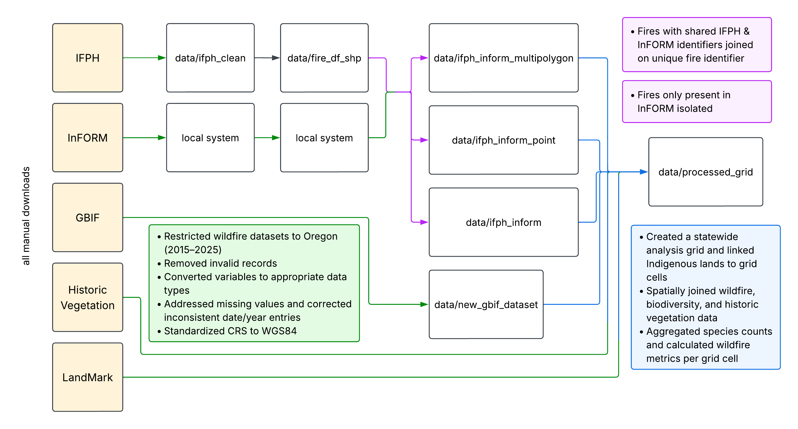

<!--
  DATA 510 write-up skeleton (Week 5 Quarto lecture).

  Copy this file to your DS3 repo:
    deliverables/M4-writeup-draft/writeup.qmd

  Week 5: paste prose from your M1 proposal into Introduction, Data, Ethics, Methods.
  Week 7+: replace stubs with real results from notebooks/ and src/.
  Week 12 (M4): methods and findings should be stable; render PDF + HTML for submission.
-->

# Title, Team, and Affiliations

**Project title:** Oregon on Fire: Wildfire Severity, Prescribed Burns, and Species Distribution Across Indigenous and Non-Indigenous Oregon Lands

| Name | Role | Willamette email |
|------|------|------------------|
| Spencer Fiden | Owner Product Lead | nefiden@willamette.edu |
| Amaya Supancich-McCord | Owner Product Lead | asupancichmccord@willamette.edu |

**Peer Stakeholder POs:** Siera Edwards, Brooke Proctor, Serenna Walter (*Shared Theme: Pacific Northwest forest and environmental health.*)

**Repository:** `https://github.com/Fiden-Supancich-McCord/data510-fire/tree/main`

# Abstract

<!-- PASTE FINAL TEXT -->

# Introduction: Problem and Research Questions

## Problem

<!-- PASTE FINAL TEXT -->

## Research Questions

<!-- PASTE FINAL TEXT -->

# Impact and Stakeholders

<!-- PASTE FINAL TEXT -->

## Tribal Governments and Indigenous Communities 

<!-- PASTE FINAL TEXT -->

## Land Management Agencies

<!-- PASTE FINAL TEXT -->

## Conservation Agencies

<!-- PASTE FINAL TEXT --> 

# Related Work and Background

<!-- PASTE FINAL TEXT -->

# Data and Data Engineering

## Data Invetory

<!-- PASTE FINAL TEXT -->

| Source | Role | Access |
|--------|------|--------|
| | | |

```{r}
#| label: tbl-data-qc
#| tbl-cap: "Example QC summary (replace with your panel)"
#| echo: true

# Replace with your project data when ready:
# panel <- readRDS(here::here("data/processed/analysis_panel.rds"))
# nrow(panel)
knitr::kable(data.frame(
  check = c("Rows", "Counties", "Date range"),
  status = c("stub", "stub", "stub")
))
```

## Data Engineering 

<!-- PASTE FINAL TEXT -->

{#fig-id fig-alt="Diagram showing the data engineering pipeline."}

### Data Cleaning and Quality Assurance

<!-- PASTE FINAL TEXT -->

### Spatial Integration and Feature Engineering

# Ethics and Responsible Use

<!-- PASTE FINAL TEXT -->

## LandMark

<!-- PASTE FINAL TEXT -->

## Global Biodiversity Information Facility (GBIF)

<!-- PASTE FINAL TEXT -->

## NIFC InFORM Fire Occurrence Data Records

<!-- PASTE FINAL TEXT -->

## NIFC Interagency Wildland Fire Perimeter History

<!-- PASTE FINAL TEXT -->

## Oregon Historic Vegetation

<!-- PASTE FINAL TEXT -->

# Methods and Evaluation

## Research Question 1

<!-- PASTE FINAL TEXT -->

### Methods

<!-- PASTE FINAL TEXT -->

### Evaluation

<!-- PASTE FINAL TEXT -->

## Research Question 2

<!-- PASTE FINAL TEXT -->

### Methods

<!-- PASTE FINAL TEXT -->

### Evaluation

<!-- PASTE FINAL TEXT -->

## Research Question 3

<!-- PASTE FINAL TEXT -->

### Methods

<!-- PASTE FINAL TEXT -->

### Evaluation

<!-- PASTE FINAL TEXT -->

```{r}
#| label: fig-methods-placeholder
#| fig-cap: "Replace with a methods diagram or exploratory plot"
#| echo: false
#| fig-width: 5
#| fig-height: 3

plot(1, 1, type = "n", xlab = "", ylab = "", main = "Methods figure placeholder")
text(1, 1, "Replace after M2/M3")
```

# Results and Visualizations

## Research Question 1

<!-- PASTE FINAL TEXT -->

### Methods

<!-- PASTE FINAL TEXT -->

### Evaluation

<!-- PASTE FINAL TEXT -->

## Research Question 1

### Species-Level Comparisons

<!-- PASTE FINAL TEXT -->

### Shannon Diversity

<!-- PASTE FINAL TEXT -->

### Model Validation

<!-- PASTE FINAL TEXT -->

## Research Question 2

### Maximum Acres Burned Across Indigenous Land Categories

<!-- PASTE FINAL TEXT -->

### Maximum Fire Duration Across Indigenous Land Categories

<!-- PASTE FINAL TEXT -->

## Research Question 3

<!-- PASTE FINAL TEXT -->

# Discussion, Limitations, and Future Work

## Discussion

<!-- PASTE FINAL TEXT -->

## Limitations

<!-- PASTE FINAL TEXT -->

## Future Work

<!-- PASTE FINAL TEXT -->

# Conclusions and Recommendations

<!-- PASTE FINAL TEXT -->

# Reproducibility and References

**Reproduce main results:**

```bash
cd your-repo
quarto render deliverables/M4-writeup-draft/writeup.qmd
```

# References

::: {#refs}
:::

